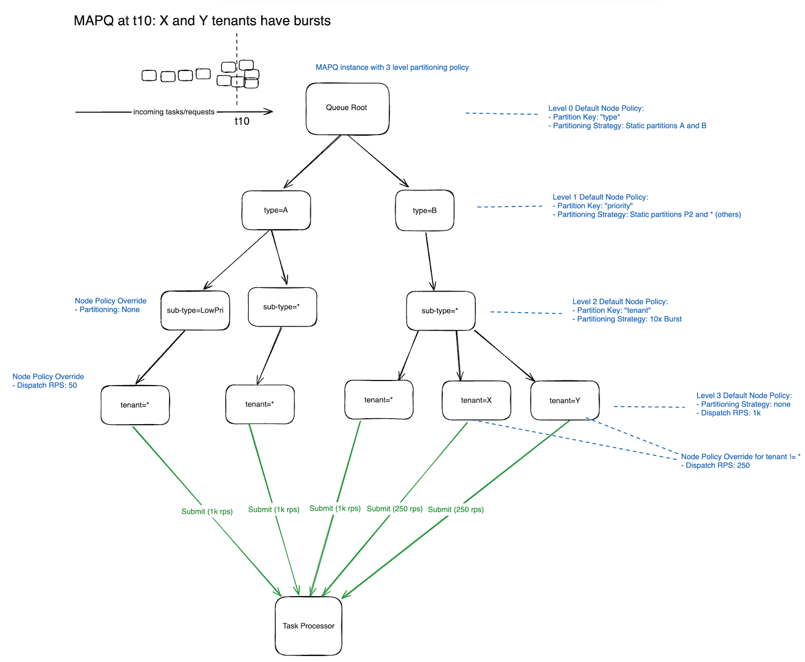

# MAPQ: Multi-tenant, Auto-partitioned, Persistent Queue

## Overview

MAPQ is a new queue framework (introduced in June 2024), aiming to unify Cadence's internal task/request queues. The existing implementations for these applications are cumbersome and maintenance-heavy, with significant overlap and limited extensibility.
MAPQ will address the challenges of scalability, throughput, consistency, and ordering guarantees required by these diverse needs.

Challenges and Motivation
- History Task Queues: These queues are poorly understood and difficult to maintain, owing to the departure of their original developer and the non-maintainable state of the code. The design struggles with burst loads from timer/child workflow cases, requiring introduction of more granular task types and automated partitioning that the current system cannot support without extensive refactoring.
- Matching Task Lists: These are basic FIFO queues with some advanced features like sticky task lists, zonal isolation groups and partitioning. The most pressing issue is auto partitioning to reduce operational overhead.
- Async Request Queues: Initially integrated with Kafka topics as the request queue. Initial testing faced challenges like complex provisioning, inability to dynamically create topics/register consumers, poor visibility into the requests in the queue and difficult to tweak alerts. Async APIs are already designed with pluggable queue implementation already so swapping Kafka with something else will not be tricky.

### Goals

MAPQ will provide a solution tailored to meet the following goals:

- Multi-Tenancy: Guarantees fair access to resources for each tenant based on predefined quotas.
- Auto-Partitioning: Dynamically adjusts partitions based on specified fine-grained policies, supporting both random and deterministic message distribution across physically or virtually partitioned queues.
- Burst-Protection: Detects incoming message spikes and mitigates by utilizing dynamic auto-partitioning.
- Skew-Protection: Detects incoming message skews for given partition keys and mitigates by utilizing dynamic auto-partitioning.
- Advanced Partitioning Policies: Executes on a tree-like partitioning policy to support various levels of partition key hierarchies and strategies.
- Persistent: Ensures message durability via pluggable persistent layer.
- Delivery Guarantees: Guarantees at least once delivery.

### Problems with Existing Queues in Cadence

History Queues:

- Lack of granular partitioning and inextensibility of history queues make it difficult to address following pathological scenarios:
- Task prioritization: Background tasks like workflow deletion timer tasks share the same queue and consume from the same “processing budget” as other high priority tasks such as user created timers. This is because all timer tasks for a given shard are managed by a single queue.
- Multi tenancy: Tasks of the same type (e.g. all timers) are managed by a single queue and a noisy domain can drastically regress the experience of other domains. It is not possible to write tasks of a specific domain(s) to a separate queue and adjust read/write qps. Current queue granularity ends at task type (timer or transfer).
- Burst cases: Bursts of timers or child workflows are known issues that Cadence has no answers to. These bursts usually cause timeouts and may also impact processing of other domains’ tasks.

## High Level Design

MAPQ uses a tree data structure where nodes route incoming messages to child nodes. Nodes can be splitted/merged based on given policies. All leaf nodes are at the same level. Leaf nodes are the actual “queues” where messages are written to/read from via a provided persistent layer plugin.

The routing key per level, partitioning/departitioning strategy, RPS limits and other options are provided to MAPQ during initialization as a tree-like policy. It contains per level defaults and per-node (identified via path from root) overrides.

Once initialized the tree will have a minimal number of nodes provided in the policy but it respects policies for not-yet-existing nodes. Since MAPQ supports auto-partitioning there will be new nodes added/removed and it accepts providing policies for such nodes. For example, you might want to partition by domain only for bursty domains and allocate them specific RPS.

