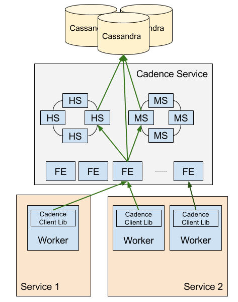

# Concepts

## Overview

Cadence is a highly scalable orchestration platform that is centered around durable function abstraction.

Usual Cadence based application consists from a Cadence Service, Workflow and Activity Workers and external clients.
Note that both types of workers as well as external clients are roles and can be collocated in a single application process if necessary.

## Cadence Service

At the core of Cadence is a highly scalable multitentant service. The service exposes all its functionality through a strongly typed [Thrift API](https://github.com/uber/cadence/blob/11448bb7729857022b9f382b356b61e8a9aa77f1/idl/github.com/uber/cadence/cadence.thrift#L33) (soon to be converted to gRPC).

Internally it depends on a persistent store. Currently Apache Cassandra and MySQL stores are supported out of the box. For listing workflows using complex predicates ElasticSearch cluster can be used.

Cadence service is responsible for keeping workflow state and associated durable timers. It maintains internal queues (called task lists) which are used to dispatch tasks to external workers.

Cadence service is multitentant. So it is expected that multiple pools of workers implementing different use cases connect to the same service instance. For example at Uber a single service is used by more than hundred applications. At the same time some external customers deploy an instance of Cadence service per application. For local development a local Cadence service instance configured through docker-compose is used.

## Workflow Worker

Cadence Service does not execute workflow code directly. The workflow code is hosted by an external (from the service point of view) _workflow worker_ processes. These processes receive so called _decision tasks_ that contain events that workflow is expected to handle from the Cadence service, delivers them to the workflow code and communicates workflow _decisions_ back to the service.

As workflow code is external to the service it can be implemented in any language that can talk service Thrift API. Currently Java and Go clients are production ready. While Python and C# clients are under development. Let us know if you are interested in contributing a client in your preferred language.

The Cadence service API doesn't impose any specific workflow definition language. So a specific worker can be implemented to execute practically any existing workflow specification. The model the Cadence team choose to support out of the box is based on durable function idea. Durable functions are as close as possible to application business logic with minimal plumbing required.

## Activity Worker

Workflow code is not expected to communicate to external systems directly. Instead it orchestrates activities. Activities are pieces of code that can perform any application specific action like calling a service, updating database record or downloading file from S3. Cadence activities are very feature-rich comparing to queuing systems. Example features are task routing to specific processes, infinite retries, heartbeats and unlimited execution time.

Activities are hosted by _activity worker_ processes that receive _activity tasks_ from the Cadence service, invoke correspondent activity implementations and report back task completion statuses.

## External Clients

Workflow and activity workers host workflow and activity code. But to create a workflow instance (an execution in Cadence terminology) the StartWorkflowExecution Cadence service API call should be used. Usually workflows are started by outside entities like UIs, microservices or CLI.

These entities can also:

- notify workflows about asynchronous external events in form of signals
- synchronously query workflow state
- synchronously wait for a workflow completion
- cancel, terminate, restart and reset workflows
- search for specific workflows using list API

