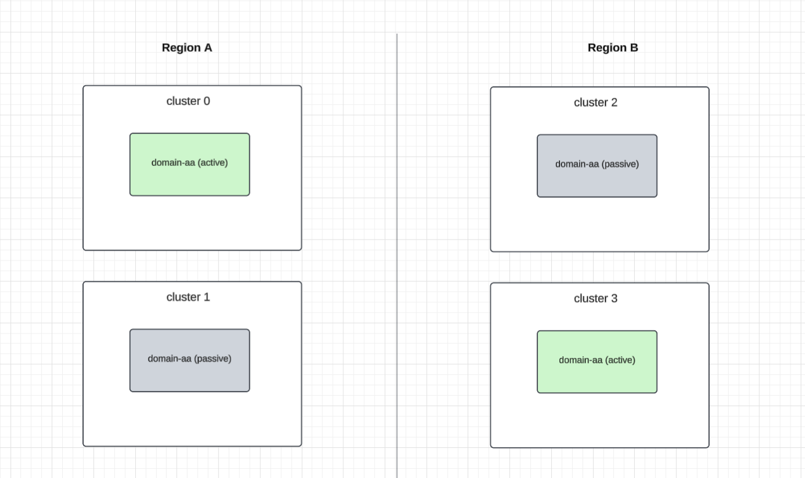

# Design doc: Cadence Active-Active

Author: [@taylanisikdemir](https://github.com/taylanisikdemir)

Last updated: Apr 2025

## Abstract

Multiple Cadence clusters can be configured to form a cluster group. Each cluster group can have multiple domains.
Currently domains are the smallest unit of isolation which supports two modes:

1. **Local Domain:** Only one cluster in the group hosts the domain. No replication.
2. **Active-Passive Domain:** Domain is active in one cluster and passive in other cluster(s). All workflows of the domain are replicated to other specified passive clusters. See [NDC doc](../2290-cadence-ndc.md) for more details.

This document describes the design and implementation of active-active domains which is a new mode where a domain can be active in multiple clusters but individual workflows are only active in one cluster at any given time.

## Background

The main drawbacks of Active-Passive approach are:

- **Cross region call forwarding:** Limiting domain to a single region may lead to cross region dependency in hot paths if the user wants to process requests in multiple regions. Passive regions will forward requests to the active region. This leads to increased latency, cost and potential timeouts.

- **Cross region data inconsistency:** Sticking with a single active Cadence region may lead to cross region data inconsistency issues for external data stores. Example:
  - A request originates in Region-0.
  - It writes something to a data store in Region-0 and starts a workflow for further processing.
  - Domain is active in Region-1 which means Cadence will forward requests to Region-1 and workers in Region-1 will process the workflow.
  - Worker in Region-1 is likely to read stale data from the data store in Region-1 because of eventual consistency of cross region data stores.

- **Underutilized workers in passive region(s):** Domain owners must deploy workers to both regions to be ready for failover. Workers in the passive region(s) stay idle. In the event of a failover, workers in the passive region(s) will need to scale up and if this is not done quickly, workflows will observe delays (potentially time outs).

- **Complexity of using multiple domains:** Current workaround to achieve active-active processing with Cadence is to create multiple domains and mark one of them active per region. E.g. domain-region0 and domain-region1. This requires users to remember which domain a specific workflow is created when they want to signal/describe the workflow. They can’t seamlessly create workflows in both regions for a single domain.


## Design

Active-active domains are a new mode of isolation where domain is active in multiple clusters but individual workflows are only active in one cluster at any given time. Users can create workflows in any of the active clusters under the same domain. Each workflow will be considered active in of the domain's active clusters. The per-workflow active cluster selection mechanism will be dynamic/extensible to support different strategies.

Before diving into the details of active-active domains design, let's look at how active-passive domains work at high level. Then we will cover how active-active domains will be implemented in follow up sections.

### Active-Passive domain's failover version

As the name suggests, an active-passive domain is active in one cluster and passive in other clusters. All the workflows of the domain are replicated to other passive clusters. Active cluster is determined by the failover version of the domain in the database.

- Cluster group configuration:
```
clusterGroupMetadata:
    failoverVersionIncrement: 10
    clusterGroup:
        cluster0:
            initialFailoverVersion: 0
            ...
        cluster1:
            initialFailoverVersion: 2
            ...
```

Active-Passive domains take the initial failover version from the cluster group configuration when they are created based on their ActiveClusterName field in the domain configuration.


- Failover version in domain records:

Failover version is a property of active-passive domains which is updated as part of failover. Domain's failover version value uniquely maps to one of the clusters by using following formula: `domain.failoverVersion % clusterGroup.failoverVersionIncrement`. Let's look at an example:


| Domain | Failover Version |
|--------|------------------|
| Domain-A | 0 |
| Domain-B | 102 |

Domain-A is active in cluster-1 because failover version `0 % 100 = 0` which belongs to cluster-1 based on above configuration.
Domain-B is active in cluster-2 because failover version `102 % 100 = 2` which belongs to cluster-2 based on above configuration. Domain-B was failed over in the past, otherwise its failover version would be `0` or `2` (initialFailoverVersion in cluster group configuration).


### Clusters and Regions

There's no "region" concept in Cadence today. However, with active-active domains, we need to introduce the concept of regions. The constraints are going to be:

1. Each cluster belongs to one region.
2. There can be multiple clusters in a region.
3. A workflow of an active-active domain can ONLY be active in one cluster in a region.
4. A workflow of an active-active domain can be passive in any number of clusters in any number of regions.



The underlying reason for these constraints is mainly to reuse existing failover version to cluster mapping that relies on failover versions. By restricting active-active domains to have only one active cluster per region, we can reuse the failover version mapping mechanism to determine the active cluster of a workflow.

Active-active domains do NOT have a failover version in the database because "activeness" is not a property of a domain. Instead, workflows of active-active domains will be associated with an "entity" which has a failover version based on the region.

The region information will be defined in cluster group configuration. e.g.
```
clusterGroupMetadata:
    primaryClusterName: cluster0
    failoverVersionIncrement: 100
    regions:  # new field.
        us-west:
            initialFailoverVersion: 1
        us-east:
            initialFailoverVersion: 3
    clusterGroup:
        cluster0:
            initialFailoverVersion: 0
            region: us-west
        cluster1:
            initialFailoverVersion: 2
            region: us-east
            ...
```


Notice that regions also have a failover version now. This will be used to determine the active cluster of a workflow based on following lookups:
- Workflow maps to an entity (or directly to a region). This is static and cannot change over time.
- Entity maps to a region. This is dynamic and can change over time.
- Region maps to a cluster. This is static and cannot change over time. Note that there can be more than one cluster in a region but an active-active domain can only have one active cluster per region.

In other words,
- All workflows of active-passive domains use the failover version of the cluster that it is active in.
- Individual workflows of active-active domains use the failover version of the region that the entity that it is associated with belongs to.


Let's look at a few examples:

**Example 1:**
Assume that we have an active-active domain called "Domain-AA-Sticky-Region" which exists in multiple regions and would like to have its workflows be active in the region they are started. We think this will be the most common use case so it's going to be the default behavior.

**Example 2:**
Assume that we have an active-active domain called "Domain-AA-User-Location" which exists in multiple regions and runs workflows per user. Each user's workflow is supposed to be processed by the cluster closest to the user's current location. Users can move around which means their workflow's active cluster will change over time.


### Active cluster selection strategies

The active cluster per workflow selection strategies must support the examples given in the previous section and must be extensible to support other use cases. To drive such extensibility, we will introduce a new table called EntityActiveRegion to store <entity, region, cluster> mapping and the active cluster of each workflow (of an active-active domain) will be determined based on that information. The workflows themselves need to be associated with an entity which can be specified by the user in start workflow request.

1. Pick the cluster that received the start workflow request
   This is the default behavior and requires no additional configuration.

2. Pick the cluster based on an external entity specified in the start workflow request.
   This is useful when the user wants to dynamically change which cluster a workflow should be active in during the lifetime of workflow.
   e.g. In "Domain-AA-User-Location" example, a workflow that is started in cluster-0 but user moved to another region and the workflow needs to be active in cluster-1 going forward.


Workflow start parameters:

| Parameter | Description | Example |
|-----------|-------------|---------|
| active-region.lookup-source | Where to look up to determine the active region of the workflow for a given key. Ideally it should support the watch API. A corresponding watcher must be implemented within Cadence. | "custom.user-location-provider" |
| active-region.lookup-key | The key to look up from the above source. | "userid-123" |

The lookup source "custom.user-location-provider" is a custom provider that can be implemented by the user. Initially we are not going to define an RPC protocol for this and it has to be implemented within Cadence.


Workflow start request determines which cluster selection strategy to be used.

| Has active-region.lookup-key | Has active-region.origin | Strategy |
|------------------------------|-------------------------|----------|
| No                           | No                      | Type 1   |
| Yes                          | No                      | Type 1   |
| No                           | Yes                     | Type 2   |

If none of the new parameters are set, the default behavior is to pick the cluster that received the start workflow request.
It's not allowed to have both active-region.lookup-key and active-region.origin set.


### EntityActiveRegion Lookup Table
- Primary key of the table is <EntityType, EntityKey>
- A new plugin system will be introduced to watch supported entity types and populate the table
- Watchers are per cluster group
    - There’s one primary cluster for the group and watcher runs on that cluster
- This table is replicated to all clusters in the cluster group from the primary cluster
- Failover Version
    - Each entity record has a failover version to be used as workflow task versions
    - Initially set based on cluster metadata
    - Incremented based on Increment value from cluster metadata whenever mapping for a key changes


| EntityType | EntityKey | Region | Failover Version | LastUpdated |
|------------|-----------|--------|------------------|-------------|
| user-location | seattle   | us-west    | 1                |             |
| user-location | boston    | us-east    | 3                |             |
| user-location | london    | eu-west    | 5                |             |
| user-location | frankfurt | eu-central    | 7                |             |
| user-location | ..        | ..         | ..               |             |
| domain | test-domain.us-west         | us-west     | 1               |             |
| domain | test-domain.us-east         | us-east     | 3               |             |
| domain | test-domain.eu-west         | eu-west     | 5               |             |
| domain | test-domain.eu-central     | eu-central  | 7               |             |


### Workflow activeness metadata in execution table
A new row will be added to executions table as part of StartWorkflow LWT for active-active-domains. It will grab external entity lookup info from workflow’s headers if provided. If no such header is provided then current cluster’s region is stored as origin. These records are immutable and are replicated as part of regular per-shard replication tasks.

| Shard | RowType | Domain | WFID | RunID | Data |
|-------|---------|--------|------|-------|------|
| 1     | ActivenessMetadata | test-domain | wf1 | 123 | Origin=us-west |
| 2     | ActivenessMetadata | test-domain | wf2 | 456 | EntityType=user-location, EntityKey=london |


In the above example:
- `wf1` is created on us-west. No external entity associations exist. Its tasks will have failover version of the
<type=domain, key=test-domain.us-west> which is 1.
- `wf2` is created with an external entity. Its tasks will have failover version of following row
<type=user-location, key=london> which is 5.


### Domain configuration

Domain configuration will have a new field called ActiveClusters which is a list of clusters that workflows of the domain can be active in. Active-active domains will have this field set. Active-passive domains will not have this field set.

```
{
	// Clusters can be a subset of clusters in the group.
	Clusters: 	    [us-west, us-east, eu-west, eu-central]

	// Active clusters can have at most one from each region. Remaining clusters will be considered passive.
	ActiveClusters:  [us-west, eu-west]
}
```

### API Call Forwarding

Cadence frontend proxies some API calls to the active cluster of the domain. Currently, this request to cluster lookup is done by checking the failover version of the active-passive domain.
For active-active domains, the lookup will be per workflow based on the active cluster of the workflow.
Same set of APIs are going to be forwarded to the active cluster.

#### APIs that are not subject to forwarding. Always served by current cluster:

- Cluster APIs
    - Health
    - GetClusterInfo

- Visibility APIs
    - CountWorkflowExecutions
    - GetSearchAttributes
    - ListArchivedWorkflowExecutions
    - ListClosedWorkflowExecutions
    - ListOpenWorkflowExecutions
    - ListWorkflowExecutions
    - ScanWorkflowExecutions

- Domain APIs
    - DeprecateDomain
    - DescribeDomain
    - RegisterDomain
    - UpdateDomain
    - ListDomains

- Tasklist APIs
    - DescribeTaskList
    - ListTaskListPartitions
    - GetTaskListsByDomain
    - ResetStickyTaskList

- Worker APIs
    - PollForActivityTask
    - PollForDecisionTask
    - RespondDecisionTaskCompleted
    - RespondDecisionTaskFailed
    - RespondQueryTaskCompleted

- Per workflow APIs
  - RestartWorkflowExecution
  - RequestCancelWorkflowExecution
  - RefreshWorkflowTasks
  - DiagnoseWorkflowExecution
  - SignalWithStartWorkflowExecutionAsync
  - StartWorkflowExecutionAsync

Note: Async API calls might be ok without forwarding (current state). We want these to be low latency and high throughput. So better to avoid checking workflow execution records. This means potentially duplicate workflow creations in active-active mode if user retries in multiple regions. Check the reconciliation logic that is supposed to dedupe these. We may revisit this in the future.

#### APIs that are forwarded to active side (selectedAPIsForwardingRedirectionPolicyAPIAllowlistV2):

- Per workflow APIs
  - StartWorkflowExecution
  - SignalWorkflowExecution
  - SignalWithStartWorkflowExecution
  - ResetWorkflowExecution
  - TerminateWorkflowExecution
  - QueryWorkflow: Forwarded to active cluster if strong consistency parameter is set to true.
  - DescribeWorkflowExecution: Forwarded to active cluster if strong consistency parameter is set to true. (This is not supported as of Apr 2025 but the work is in progress.)
  - GetWorkflowExecutionHistory: Forwarded to active cluster if strong consistency parameter is set to true. (This is not supported as of Apr 2025 but the work is in progress.)

- Worker APIs
  - RecordActivityTaskHeartbeat
  - RecordActivityTaskHeartbeatByID
  - RespondActivityTaskCanceled
  - RespondActivityTaskCanceledByID
  - RespondActivityTaskCompleted
  - RespondActivityTaskCompletedByID
  - RespondActivityTaskFailed
  - RespondActivityTaskFailedByID


### Entity mapping updates

There are two categories of entity types:

1. Domain/region entities
2. User defined entities

Domain/region entities are entities that are managed by default domain plugin as part of typical domain operations.
- Domain creation: Populate EntityActiveRegion table with `{domain}.{region}` for all regions in `ActiveClusters` list.
- Domain update: Update EntityActiveRegion table with `{domain}.{region}` for all regions in `ActiveClusters` list. Increment failover version based on region failover version and increment value from cluster group configuration.
- Domain deletion: Delete all relevant rows from EntityActiveRegion table.

User defined entities are entities that are defined by the user and are used to associate workflows with an external entity. Corresponding watcher implementation will be provided by the user. It should perform CRUD operations on EntityActiveRegion table following similar pattern to domain/region entities.

Entity updates are replicated to all clusters and history service will subscribe to these updates to notify task queues. This is similar to how domain failover changes are handled today. Notifying the task queues wake up the queues to resume processing and they will be able to apply active/standby logic based on new failover versions.
